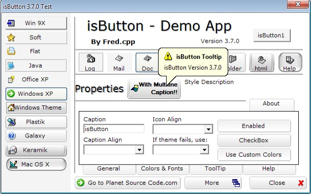



## isButton 3\.7\.0 the multi style button \(update\)

### Description

isButton 3.7.0 (original by Fred.cpp) the multi style button Updated 2007-12-27.

This is an update to support Windows XP/2003 Data Execution Prevention (DEP). Added new Paul Caton Self Subclassed.

Also fixes a bug where the ToolTipText was not saved properly.
 
### More Info
 
This is an update to support Windows XP/2003 Data Execution Prevention (DEP). Added new Paul Caton Self Subclassed.

Also fixes a bug where the ToolTipText was not saved properly.

             |
---                |---
**Submitted On**   |2007-12-31 10:52:36
**By**             |[David Cunha](https://github.com/Planet-Source-Code/PSCIndex/blob/master/ByAuthor/david-cunha.md)
**Level**          |Intermediate
**User Rating**    |5.0 (35 globes from 7 users)
**Compatibility**  |VB 6\.0
**Category**       |[Custom Controls/ Forms/  Menus](https://github.com/Planet-Source-Code/PSCIndex/blob/master/ByCategory/custom-controls-forms-menus__1-4.md)
**World**          |[Visual Basic](https://github.com/Planet-Source-Code/PSCIndex/blob/master/ByWorld/visual-basic.md)
**Archive File**   |[isButton\_320957512312007\.zip](https://github.com/Planet-Source-Code/david-cunha-isbutton-3-7-0-the-multi-style-button-update__1-69843/archive/master.zip)

### API Declarations

Many

